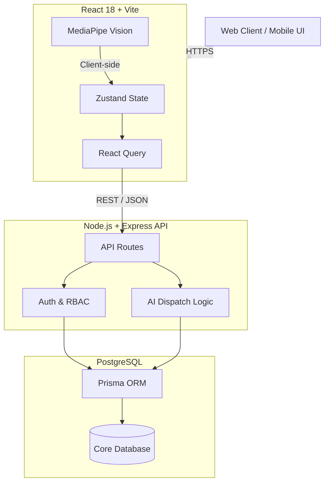
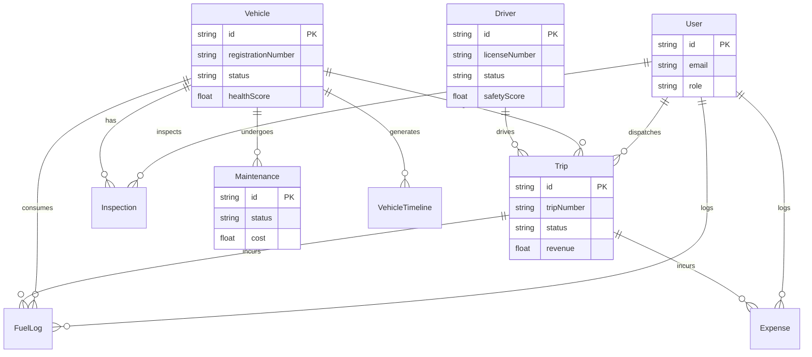

<p align="center">
  
</p>

<h1 align="center">TransitOps</h1>

<p align="center">
  <strong>AI-Powered Smart Transport Operations Platform</strong>
</p>

<p align="center">
  
  
  
  
  
  
  
</p>

<p align="center">
  Digitizes the complete fleet lifecycle: vehicle registration, driver management, AI dispatch, maintenance, fuel tracking, computer vision safety, financial analytics, and predictive intelligence.
</p>

<p align="center">
  <strong><a href="https://odoo-transitops-jenil.vercel.app">Live Demo</a></strong> •
  <strong><a href="https://drive.google.com/drive/folders/1xlMjWQNHyjsnxTH__hGHoR4EwBsdKkhY?usp=sharing">Google Drive (Video & Assets)</a></strong>
</p>

<p align="center">
  <em>Made by <a href="https://harmit.vercel.app">Harmit Kalal</a> | <a href="https://www.jenil.me">Jenil Soni</a> | Aarth Patel</em>
</p>

---

## Quick Start

```bash
git clone https://github.com/Harmitx7/TransitOps.git
cd TransitOps
chmod +x start.sh
./start.sh
```

<table width="100%">
  <thead>
    <tr>
      <th>Service</th>
      <th>URL</th>
    </tr>
  </thead>
  <tbody>
    <tr>
      <td>Client</td>
      <td>`http://localhost:5173`</td>
    </tr>
    <tr>
      <td>API</td>
      <td>`http://localhost:3001/api`</td>
    </tr>
    <tr>
      <td>Health</td>
      <td>`http://localhost:3001/health`</td>
    </tr>
  </tbody>
</table>

**Demo Login:** `admin@transitops.io` / `Admin@123`

---

## 🚀 One-Click Vercel Deployment (Demo Mode)

TransitOps can be deployed entirely frontend-only (no database or backend required) using the built-in **Mock API Engine**. This is perfect for portfolio showcases and hackathon presentations.

1. Connect your repository to Vercel.
2. In the Vercel project settings, set the **Root Directory** to `client`.
3. Add the following Environment Variable:
   - `VITE_DEMO_MODE=true`
4. Click **Deploy**.

*The app will automatically use the `axios-mock-adapter` to intercept all network requests and supply rich, interactive mock data.*

---

## Theme & Design System

TransitOps uses a custom modern design system optimized for data-dense dashboards. Every component is designed for maximum readability, featuring smooth dark/light mode transitions, responsive grid layouts, and high-contrast UI elements.

<table>
<tr>
<td width="50%">

### Light Mode


</td>
<td width="50%">

### Dark Mode


</td>
</tr>
</table>

- Pre-filled demo accounts for instant access
- Role-based login: Admin, Fleet Manager, Dispatcher, Safety Officer, Finance Manager, Driver
- JWT authentication with bcrypt password hashing
- Error shake animation on invalid credentials
- Theme toggle persists across sessions

---

## Dashboard

<table>
<tr>
<td width="50%">

### Light Dashboard


</td>
<td width="50%">

### Dark Dashboard


</td>
</tr>
</table>

### KPI Metrics at a Glance

<table>
  <tr>
    <td align="center"></td>
    <td align="center"></td>
  </tr>
  <tr>
    <td align="center"></td>
    <td align="center"></td>
  </tr>
</table>

### Dashboard Modules

<ul>
  <li> <b>Bento Grid Layout</b> with 12-column CSS Grid</li>
  <li> <b>Animated Gauge Rings</b> with conic-gradient fills</li>
  <li> <b>Live Camera Feeds</b> with 16:9 aspect ratio cards</li>
  <li> <b>Interactive Map Panel</b> with Google Maps / Leaflet tiles</li>
  <li> <b>Revenue vs Cost Trend Charts</b> (Recharts)</li>
  <li> <b>Fleet Status Donut Chart</b> with color-coded segments</li>
  <li> <b>Quick Action Buttons</b>: New Trip, Log Fuel, License Plate Scan</li>
  <li> <b>Real-time Notification Badge</b> in the topbar</li>
</ul>

---

## Feature Modules

### 1. Live Fleet Map


- Real-time vehicle tracking on interactive Leaflet/Google Maps
- Color-coded markers: Green (moving), Blue (idle), Red (maintenance)
- Click any vehicle to see trip details, ETA, and route polyline
- Collapsible side panel with full fleet list
- Speed and heading indicators per vehicle
- Customer ETA sharing via public tracking URL (no auth required)

---

### 2. Vehicle Registry and Management


- Full CRUD for 15+ vehicle types (Truck, Bus, Van, Car)
- Unique registration number enforcement
- **Health Score Gauge** (0-100) based on 6 weighted factors
- **QR Code** auto-generated per vehicle for quick scanning
- **Document Vault**: Insurance, Registration, Fitness, PUC certificates with expiry tracking
- **Vehicle Timeline**: Chronological event log (trips, maintenance, inspections, fuel)
- Filter by status: Available, On Trip, In Shop, Retired
- Odometer tracking with km/miles display

---

### 3. AI Smart Routing


**2x2 Grid Layout:**

<table width="100%">
  <thead>
    <tr>
      <th>Cell</th>
      <th>Module</th>
    </tr>
  </thead>
  <tbody>
    <tr>
      <td>Top-Left</td>
      <td>**Plan Route** with Uber-style booking inputs and quick-select location chips</td>
    </tr>
    <tr>
      <td>Top-Right</td>
      <td>**Route Selection** with 3 optimized route cards (Fastest, Fuel Efficient, Lowest Toll)</td>
    </tr>
    <tr>
      <td>Bottom (Full Width)</td>
      <td>**Vehicle Assignment** as horizontal scrollable carousel of vehicle cards</td>
    </tr>
  </tbody>
</table>

**AI Dispatch Scoring Algorithm:**
```
score = (proximity x 0.25) + (health x 0.20) + (fuelEfficiency x 0.20)
      + (driverSafety x 0.20) + (availability x 0.15)
```

**Fuel Prediction Model:**
```
fuel = baseRate x distance x (1 + loadFactor) x vehicleAgeFactor
```

<table width="100%">
  <thead>
    <tr>
      <th>Vehicle Type</th>
      <th>Base Rate (L/km)</th>
    </tr>
  </thead>
  <tbody>
    <tr>
      <td>Truck</td>
      <td>0.25</td>
    </tr>
    <tr>
      <td>Bus</td>
      <td>0.20</td>
    </tr>
    <tr>
      <td>Van</td>
      <td>0.12</td>
    </tr>
    <tr>
      <td>Car</td>
      <td>0.08</td>
    </tr>
  </tbody>
</table>

---

### 4. Driver Camera Safety and Live Streams


- **Multi-camera CCTV Grid** with live video feeds
- **Drowsiness Detection** using MediaPipe Face Landmarker
- **Eye Aspect Ratio (EAR)** calculation in real-time
- Alert triggers after 60 consecutive frames below 0.21 threshold (~2 seconds)
- Color-coded camera borders: Green (Normal), Amber (Drowsy), Red (Alert with pulse animation)
- Per-driver drowsiness score gauge
- **Seatbelt Detection**: AI monitors proper seatbelt usage during transit.
- **Face Verification**: Pre-dispatch identity authentication to prevent unauthorized drivers.
- CRT scanline and noise overlay effects for authentic CCTV aesthetic
- HUD-style PTZ controls and timestamp overlays

**EAR Calculation:**
```
EAR = (||p2-p6|| + ||p3-p5||) / (2 x ||p1-p4||)
Threshold: 0.21 (configurable)
Alert: 60 frames below threshold at 30fps = ~2 seconds
```

---

### 5. License Plate Scanning and Detection (OCR)


- **YOLO v8** object detection for plate localization
- **EasyOCR / Tesseract** for character recognition
- Mobile-optimized: rear camera with alignment guide overlay
- Desktop fallback: drag-and-drop image upload
- Instant vehicle lookup from database on detection
- Confidence score with progress bar
- Entry/Exit logging for gate management
- Demo mode with pre-loaded sample plate images

<table width="100%">
  <thead>
    <tr>
      <th>Metric</th>
      <th>Score</th>
    </tr>
  </thead>
  <tbody>
    <tr>
      <td>Detection Accuracy</td>
      <td>94%+</td>
    </tr>
    <tr>
      <td>OCR Confidence</td>
      <td>91%+</td>
    </tr>
    <tr>
      <td>Processing Time</td>
      <td>< 500ms</td>
    </tr>
  </tbody>
</table>

---

### 6. Vehicle Inspection Pass/Fail


**14-Point Digital Checklist:**

<table width="100%">
  <thead>
    <tr>
      <th>#</th>
      <th>Inspection Item</th>
    </tr>
  </thead>
  <tbody>
    <tr>
      <td>1</td>
      <td>Engine Oil Level</td>
    </tr>
    <tr>
      <td>2</td>
      <td>Brake System</td>
    </tr>
    <tr>
      <td>3</td>
      <td>Tire Condition (all wheels)</td>
    </tr>
    <tr>
      <td>4</td>
      <td>Headlights and Taillights</td>
    </tr>
    <tr>
      <td>5</td>
      <td>Turn Signals</td>
    </tr>
    <tr>
      <td>6</td>
      <td>Windshield and Wipers</td>
    </tr>
    <tr>
      <td>7</td>
      <td>Horn</td>
    </tr>
    <tr>
      <td>8</td>
      <td>Mirrors</td>
    </tr>
    <tr>
      <td>9</td>
      <td>Seatbelts</td>
    </tr>
    <tr>
      <td>10</td>
      <td>Fire Extinguisher</td>
    </tr>
    <tr>
      <td>11</td>
      <td>First Aid Kit</td>
    </tr>
    <tr>
      <td>12</td>
      <td>Reflective Triangles</td>
    </tr>
    <tr>
      <td>13</td>
      <td>Fluid Leaks</td>
    </tr>
    <tr>
      <td>14</td>
      <td>Body Damage</td>
    </tr>
  </tbody>
</table>

- Toggle Pass/Fail per item with optional failure notes
- Progress bar showing completion percentage
- **Business Rule**: Failed inspection blocks vehicle dispatch
- Status badges: PASSED (teal), FAILED (red), PENDING (amber)

---

### 7. Trip Details and Operations


**Trip Lifecycle State Machine:**

```
DRAFT --> SCHEDULED --> DISPATCHED --> IN_PROGRESS --> COMPLETED
  |           |             |                            |
  +---> CANCELLED <----+----+----------------------------+
```

- 3-step trip creation wizard: Route, Assignment, Cargo
- Lifecycle progress bar with 5 visual stages
- Route map preview with source/destination markers
- Cargo weight validation against vehicle max load capacity
- Financial tracking: Revenue, Fuel Cost, Tolls, Net Profit
- Status-dependent action buttons (Schedule, Dispatch, Start, Complete, Cancel)

---

### 8. Driver Registry


- Full CRUD with 10+ seeded driver profiles
- **Safety Score Gauge** (0-100) based on 6 weighted factors:
  - Accidents, Violations, On-time Rate, Fuel Efficiency, Inspection Pass Rate, Experience
- License management: Number, Category (LMV/HMV/HGV etc.), Expiry date
- **License Expiry Alerts**: Color-coded indicators
  - Green: > 30 days remaining
  - Amber: 7-30 days remaining
  - Red: < 7 days or expired
- Driver health report and fitness documentation
- Trip history tab with route, vehicle, distance, and status
- Drowsiness alert history from CV monitoring
- Face verification profile for driver identity checks

---

### 9. Vehicle Maintenance Center


- 4 maintenance types: Preventive, Corrective, Emergency, Inspection
- Status workflow: Scheduled, In Progress, Completed, Cancelled
- **Auto Status Change**: Scheduling maintenance sets vehicle to "In Shop"; completing it restores to "Available"
- Cost tracking per maintenance record
- Parts replacement logging
- Mechanic assignment
- Expandable row details with notes and duration

---

### 10. Fuel Logs and Consumption Management


- Dual-tab interface: Fuel Logs | Expenses
- **Fuel Anomaly Detection**: Statistical 2-sigma deviation flagging
- 7 expense categories: Fuel, Toll, Maintenance, Insurance, Registration, Salary, Other
- Summary KPI cards: Total Liters, Avg Cost/Liter, Anomalies Detected
- Expense breakdown donut chart by category
- Monthly fuel cost trend line chart
- Anomaly rows highlighted with danger indicator

---

### 11. Reports and PDF Generation


**8 Report Types:**

<table width="100%">
  <thead>
    <tr>
      <th>Report</th>
      <th>Description</th>
    </tr>
  </thead>
  <tbody>
    <tr>
      <td>Fleet Summary</td>
      <td>All vehicle stats aggregated</td>
    </tr>
    <tr>
      <td>Vehicle Report</td>
      <td>Deep dive on a single vehicle</td>
    </tr>
    <tr>
      <td>Driver Performance</td>
      <td>Safety and trip statistics</td>
    </tr>
    <tr>
      <td>Trip Report</td>
      <td>Route map, QR code, financials</td>
    </tr>
    <tr>
      <td>Fuel Consumption</td>
      <td>Trends and anomaly analysis</td>
    </tr>
    <tr>
      <td>Expense Report</td>
      <td>Category and period breakdown</td>
    </tr>
    <tr>
      <td>Maintenance History</td>
      <td>Fleet-wide or per-vehicle</td>
    </tr>
    <tr>
      <td>ROI Analysis</td>
      <td>Revenue vs cost per vehicle</td>
    </tr>
  </tbody>
</table>

- **PDF Export**: html2canvas + jsPDF for client-side generation
- **CSV Export**: Client-side array-to-CSV with UTF-8 BOM
- Date range picker and vehicle/driver selector parameters
- In-page preview before download

---

### 12. Alerts, Events, and Notifications


- **12 Notification Types**: License Expiry, Maintenance Due, Fuel Anomaly, Trip Updates, Inspection Failed, Drowsiness Alert, and more
- Topbar bell icon with unread badge count
- Dropdown panel with recent 10 notifications
- Full-page notification center with type filters
- Color-coded severity borders: Danger (red), Warning (amber), Success (green), Info (blue)
- **Email Notifications**: Automated event reports sent to authorized personnel via Nodemailer
- **Cron-based Expiry Alerts**: Triggers at 60, 30, 15, 7, and 1 day before document expiry

---

### 13. Settings


- **Profile Management**: View/edit name, email, avatar
- **Appearance**: Light/Dark theme toggle, accent color selection
- **Notification Preferences**: Toggle per notification type
- **Security**: Password change with confirmation
- **System Info**: API version, database, environment, tech stack

---

## Document Vault and Compliance

TransitOps maintains a secure document management system for all fleet paperwork:

- **Vehicle Documents**: Insurance, Registration Certificate (RC), Fitness Certificate, PUC, Permit
- **Driver Documents**: License (with category), Health/Fitness Report, Address Proof
- **Expiry Monitoring**: Automated cron job checks at 60/30/15/7/1 day intervals
- **Alert Cascade**: In-app notification, email to fleet manager, dashboard warning badge
- **Audit Trail**: Every document upload, update, and expiry event is logged

---

## Architecture

### System Overview

```
+------------------+        +------------------+        +------------------+
|                  |        |                  |        |                  |
|   React + Vite   | <----> |  Express + JWT   | <----> |   PostgreSQL     |
|   (Port 5173)    |  REST  |  (Port 3001)     | Prisma |   (Port 5432)    |
|                  |        |                  |        |                  |
+------------------+        +------------------+        +------------------+
        |                           |
        v                           v
+------------------+        +------------------+
|  Leaflet Maps    |        |  Nodemailer      |
|  MediaPipe CV    |        |  node-cron       |
|  Recharts        |        |  Zod Validation  |
+------------------+        +------------------+
```

### Tech Stack

<table width="100%">
  <thead>
    <tr>
      <th>Layer</th>
      <th>Technologies</th>
    </tr>
  </thead>
  <tbody>
    <tr>
      <td>**Frontend**</td>
      <td>React 18, TypeScript, Vite 6, Vanilla CSS (Custom Design System)</td>
    </tr>
    <tr>
      <td>**State**</td>
      <td>Zustand (auth, theme, sidebar, notifications)</td>
    </tr>
    <tr>
      <td>**Data Fetching**</td>
      <td>TanStack React Query with Axios</td>
    </tr>
    <tr>
      <td>**Charts**</td>
      <td>Recharts (SVG-based, composable)</td>
    </tr>
    <tr>
      <td>**Maps**</td>
      <td>react-leaflet + Leaflet with Google/OSM tiles</td>
    </tr>
    <tr>
      <td>**Icons**</td>
      <td>lucide-react (tree-shakeable SVGs, zero emojis)</td>
    </tr>
    <tr>
      <td>**Forms**</td>
      <td>react-hook-form + Zod validation</td>
    </tr>
    <tr>
      <td>**PDF/CSV**</td>
      <td>html2canvas + jsPDF (client), PDFKit (server)</td>
    </tr>
    <tr>
      <td>**QR Codes**</td>
      <td>qrcode.react</td>
    </tr>
    <tr>
      <td>**Backend**</td>
      <td>Node.js 20+, Express.js, TypeScript</td>
    </tr>
    <tr>
      <td>**ORM**</td>
      <td>Prisma 7 with PostgreSQL adapter</td>
    </tr>
    <tr>
      <td>**Database**</td>
      <td>PostgreSQL 16 (ACID, JSONB, full-text search)</td>
    </tr>
    <tr>
      <td>**Auth**</td>
      <td>JWT (jsonwebtoken) + bcryptjs</td>
    </tr>
    <tr>
      <td>**CV/AI**</td>
      <td>MediaPipe Face Landmarker, YOLO v8, EasyOCR</td>
    </tr>
    <tr>
      <td>**Email**</td>
      <td>Nodemailer for automated notifications</td>
    </tr>
  </tbody>
</table>

### Database Schema

```
12 models | 6 enums | 15+ indexed fields
```

<table width="100%">
  <thead>
    <tr>
      <th>Model</th>
      <th>Key Fields</th>
    </tr>
  </thead>
  <tbody>
    <tr>
      <td>User</td>
      <td>email, role (6 RBAC roles), lastLogin</td>
    </tr>
    <tr>
      <td>Vehicle</td>
      <td>registrationNumber, healthScore, status, document expiries</td>
    </tr>
    <tr>
      <td>Driver</td>
      <td>licenseNumber, safetyScore, faceEmbedding, status</td>
    </tr>
    <tr>
      <td>Trip</td>
      <td>7-state lifecycle, source/dest coords, cargo, revenue</td>
    </tr>
    <tr>
      <td>Maintenance</td>
      <td>4 types, cost, parts, auto status transitions</td>
    </tr>
    <tr>
      <td>FuelLog</td>
      <td>quantity, costPerUnit, anomaly flag, odometer</td>
    </tr>
    <tr>
      <td>Expense</td>
      <td>7 categories, receipt storage, trip linkage</td>
    </tr>
    <tr>
      <td>Inspection</td>
      <td>14-item JSON checklist, pass/fail with notes</td>
    </tr>
    <tr>
      <td>Notification</td>
      <td>12 types, read/unread, user targeting</td>
    </tr>
    <tr>
      <td>VehicleTimeline</td>
      <td>11 event types, chronological history</td>
    </tr>
    <tr>
      <td>AuditLog</td>
      <td>full activity tracking, IP logging</td>
    </tr>
  </tbody>
</table>

---

## API Endpoints

```
POST   /api/auth/login          # JWT authentication
POST   /api/auth/register       # Admin-only user creation
GET    /api/auth/me             # Current user profile

GET    /api/dashboard/stats     # Aggregated KPI metrics

CRUD   /api/vehicles            # Fleet registry
CRUD   /api/drivers             # Driver management
CRUD   /api/trips               # Trip lifecycle operations
CRUD   /api/maintenance         # Maintenance scheduling
CRUD   /api/fuel                # Fuel log tracking
CRUD   /api/notifications       # Alert management

GET    /api/search?q=           # Global search (vehicles, drivers, trips)
```

---

## Business Rules Engine

19 validated business rules enforced across the platform:

<table width="100%">
  <thead>
    <tr>
      <th>Rule</th>
      <th>Description</th>
    </tr>
  </thead>
  <tbody>
    <tr>
      <td>VR-001</td>
      <td>Unique vehicle registration number</td>
    </tr>
    <tr>
      <td>TR-001</td>
      <td>Cargo weight cannot exceed vehicle max load</td>
    </tr>
    <tr>
      <td>TR-002</td>
      <td>Vehicle must be AVAILABLE for trip assignment</td>
    </tr>
    <tr>
      <td>TR-003</td>
      <td>Driver must be AVAILABLE for trip assignment</td>
    </tr>
    <tr>
      <td>MR-001</td>
      <td>Scheduling maintenance auto-sets vehicle to IN_SHOP</td>
    </tr>
    <tr>
      <td>MR-002</td>
      <td>Completing maintenance auto-restores AVAILABLE status</td>
    </tr>
    <tr>
      <td>IR-001</td>
      <td>Failed inspection blocks vehicle dispatch</td>
    </tr>
    <tr>
      <td>LR-001</td>
      <td>Expired license flags driver as non-compliant</td>
    </tr>
    <tr>
      <td>FR-001</td>
      <td>Fuel anomaly detection via 2-sigma statistical threshold</td>
    </tr>
  </tbody>
</table>

---

## Performance Targets

<table width="100%">
  <thead>
    <tr>
      <th>Metric</th>
      <th>Target</th>
    </tr>
  </thead>
  <tbody>
    <tr>
      <td>API Response Time</td>
      <td>< 200ms</td>
    </tr>
    <tr>
      <td>AI Endpoint Response</td>
      <td>< 500ms</td>
    </tr>
    <tr>
      <td>Fleet Utilization Rate</td>
      <td>> 75%</td>
    </tr>
    <tr>
      <td>Dispatch Time</td>
      <td>< 2 minutes</td>
    </tr>
    <tr>
      <td>Maintenance Compliance</td>
      <td>100%</td>
    </tr>
    <tr>
      <td>Document Expiry Coverage</td>
      <td>100%</td>
    </tr>
    <tr>
      <td>Report Generation</td>
      <td>< 5 seconds</td>
    </tr>
    <tr>
      <td>Concurrent Users</td>
      <td>50+</td>
    </tr>
  </tbody>
</table>

---

## Mobile-First Portable Experience

TransitOps offers a dedicated, fully responsive mobile view designed for **better, easy, and portable use** by drivers and on-the-go managers.

<table>
<tr>
<td width="50%" align="center">
  
</td>
<td width="50%" align="center">
  
</td>
</tr>
</table>

- **Dedicated Mobile Navigation**: Bottom tab bar replaces the sidebar for instant one-handed access.
- **Global CSS variable scaling** at 768px breakpoint (reduced spacing, typography, radii).
- **Horizontal scrollable tabs** for status filters to maximize screen real estate.
- **Single-column card layouts** ensuring data is perfectly readable on small screens.
- **Touch-optimized buttons** with larger tap targets.
- **Collapsible elements** ensuring the dashboard fits entirely inside the mobile viewport.
- **Multi-language Support**: Layouts architected to support English, Hindi, and Gujarati localization.

---

## Security

<table width="100%">
  <thead>
    <tr>
      <th>Feature</th>
      <th>Implementation</th>
    </tr>
  </thead>
  <tbody>
    <tr>
      <td>Authentication</td>
      <td>JWT with HS256 signing</td>
    </tr>
    <tr>
      <td>Password Hashing</td>
      <td>bcrypt with 12 salt rounds</td>
    </tr>
    <tr>
      <td>RBAC</td>
      <td>6 roles with permission matrix</td>
    </tr>
    <tr>
      <td>Protected Routes</td>
      <td>Middleware chain (verifyToken + requireRole)</td>
    </tr>
    <tr>
      <td>Input Validation</td>
      <td>Zod schemas on every endpoint</td>
    </tr>
    <tr>
      <td>Session Management</td>
      <td>Token expiry (24h), auto-redirect on 401</td>
    </tr>
  </tbody>
</table>

---

## Audit Logs / Activity History

TransitOps maintains a complete, enterprise-grade history of every important system action. 
- **Traceability**: Logs user logins, vehicle creation, trip dispatch, maintenance updates, and fuel entries.
- **Accountability**: Every action is tied to a user ID and IP address.
- **Debugging**: Easily trace state changes (e.g., who changed the vehicle status to "In Shop").

---

## Demo Accounts

<table width="100%">
  <thead>
    <tr>
      <th>Role</th>
      <th>Email</th>
      <th>Password</th>
    </tr>
  </thead>
  <tbody>
    <tr>
      <td>Admin</td>
      <td>`admin@transitops.io`</td>
      <td>`Admin@123`</td>
    </tr>
    <tr>
      <td>Fleet Manager</td>
      <td>`fleet@transitops.io`</td>
      <td>`Fleet@123`</td>
    </tr>
    <tr>
      <td>Dispatcher</td>
      <td>`dispatch@transitops.io`</td>
      <td>`Dispatch@123`</td>
    </tr>
    <tr>
      <td>Safety Officer</td>
      <td>`safety@transitops.io`</td>
      <td>`Safety@123`</td>
    </tr>
    <tr>
      <td>Finance Manager</td>
      <td>`finance@transitops.io`</td>
      <td>`Finance@123`</td>
    </tr>
    <tr>
      <td>Driver</td>
      <td>`driver@transitops.io`</td>
      <td>`Driver@123`</td>
    </tr>
  </tbody>
</table>

---

## Seeded Data

<table width="100%">
  <thead>
    <tr>
      <th>Entity</th>
      <th>Count</th>
    </tr>
  </thead>
  <tbody>
    <tr>
      <td>Users</td>
      <td>6</td>
    </tr>
    <tr>
      <td>Vehicles</td>
      <td>15</td>
    </tr>
    <tr>
      <td>Drivers</td>
      <td>10</td>
    </tr>
    <tr>
      <td>Trips</td>
      <td>25</td>
    </tr>
    <tr>
      <td>Maintenance Records</td>
      <td>8</td>
    </tr>
    <tr>
      <td>Fuel Logs</td>
      <td>30</td>
    </tr>
    <tr>
      <td>Expenses</td>
      <td>20</td>
    </tr>
    <tr>
      <td>Inspections</td>
      <td>5</td>
    </tr>
    <tr>
      <td>Notifications</td>
      <td>50</td>
    </tr>
    <tr>
      <td>Timeline Events</td>
      <td>40</td>
    </tr>
  </tbody>
</table>

---

## Project Structure

```
TransitOps/
  client/                     # React + Vite Frontend
    src/
      components/layout/      # Sidebar, Topbar, BottomNav
      features/
        auth/                  # Login, Protected Routes
        dashboard/             # KPI Cards, Charts, Bento Grid
        vehicles/              # Fleet Registry CRUD
        drivers/               # Driver Management CRUD
        trips/                 # Trip Lifecycle Operations
        maintenance/           # Maintenance Scheduling
        fuel/                  # Fuel & Expense Tracking
        reports/               # PDF/CSV Report Generation
        fleet-map/             # Live Map with Leaflet
        inspections/           # Digital 14-Point Checklist
        ai/                    # Smart Routing & AI Dispatch
        cv/                    # Drowsiness, LPR, Safety Monitor
        events/                # System Events & Alerts
        settings/              # Profile, Theme, Security
      store/                   # Zustand Stores
      styles/                  # Custom Design System
  server/                     # Express + Prisma Backend
    src/
      config/                  # Database, Auth Config
      middleware/              # JWT Verification, RBAC
      routes/                  # REST API Endpoints
    prisma/
      schema.prisma            # 12 Models, 6 Enums
      seed.ts                  # Demo Data Generator
  assets/                     # Screenshots & Media
  docs/                       # PRD, Feature Audit, Module Docs
  start.sh                    # One-command launcher
```

---

## Why TransitOps

<table width="100%">
  <thead>
    <tr>
      <th>Problem</th>
      <th>TransitOps Solution</th>
    </tr>
  </thead>
  <tbody>
    <tr>
      <td>Manual vehicle allocation</td>
      <td>AI dispatch with 5-factor scoring algorithm</td>
    </tr>
    <tr>
      <td>Driver safety blind spots</td>
      <td>Real-time drowsiness detection with MediaPipe</td>
    </tr>
    <tr>
      <td>Expired documents and licenses</td>
      <td>Automated cron alerts at 60/30/15/7/1 day intervals</td>
    </tr>
    <tr>
      <td>No fleet visibility</td>
      <td>Live GPS map with color-coded vehicle markers</td>
    </tr>
    <tr>
      <td>Paper-based inspections</td>
      <td>Digital 14-point checklist that blocks unsafe dispatch</td>
    </tr>
    <tr>
      <td>Fuel theft and waste</td>
      <td>Statistical anomaly detection (2-sigma)</td>
    </tr>
    <tr>
      <td>Slow report generation</td>
      <td>One-click PDF/CSV with in-page preview</td>
    </tr>
    <tr>
      <td>Fragmented spreadsheets</td>
      <td>Unified platform covering the entire fleet lifecycle</td>
    </tr>
  </tbody>
</table>

---

---

## System Architecture

TransitOps is built on a scalable, decoupled architecture designed for high availability and real-time operations.



---

## Database Schema

The system leverages a robust relational database consisting of 12 core models tracking the entire fleet lifecycle.



---

## Core Contributors

TransitOps was developed collaboratively during an intense 8-Hour Hackathon.

- **Harmit Kalal** ([Harmitx7](https://github.com/Harmitx7)) – Full-Stack Architecture, API Design, & Authentication
- **Jenil Soni** ([JenilRevaliya](https://github.com/JenilRevaliya)) – Frontend Engineering, System UI/UX, & Computer Vision AI
- **Aarth Patel** ([Aarth](https://github.com/Aarth)) – Database Modeling & Data Pipelines

> **Note:** To officially show up in the GitHub Repository's sidebar as a "Contributor" on the original `Harmitx7` repository, Harmit needs to navigate to `Settings > Collaborators` on GitHub and send an invite to `JenilRevaliya` and `Aarth`. Once accepted, GitHub will formally recognize you!

---

<p align="center">
  <strong>Built for the future of fleet operations.</strong>
</p>
